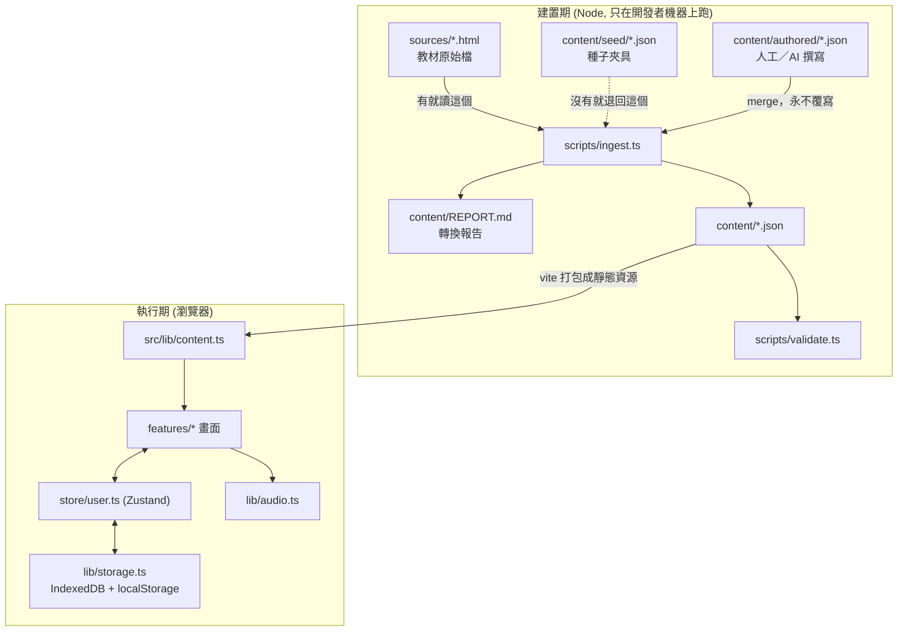
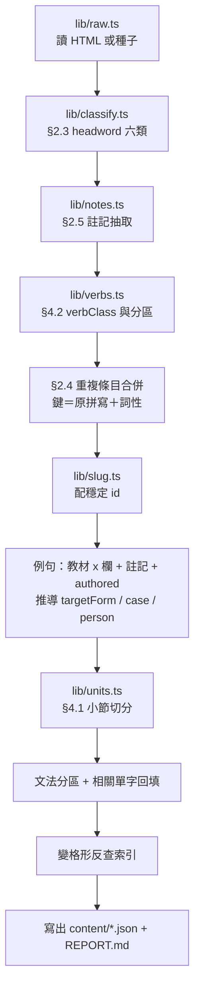
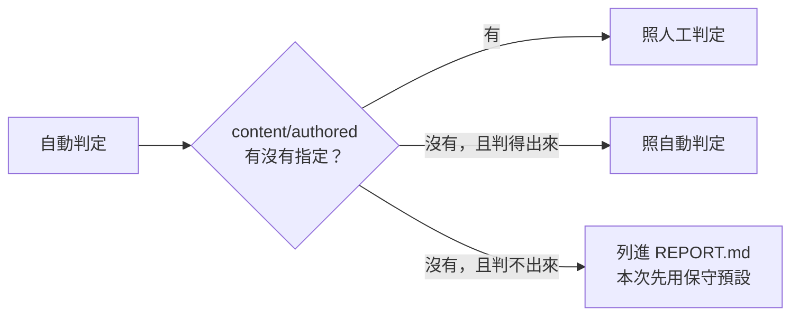
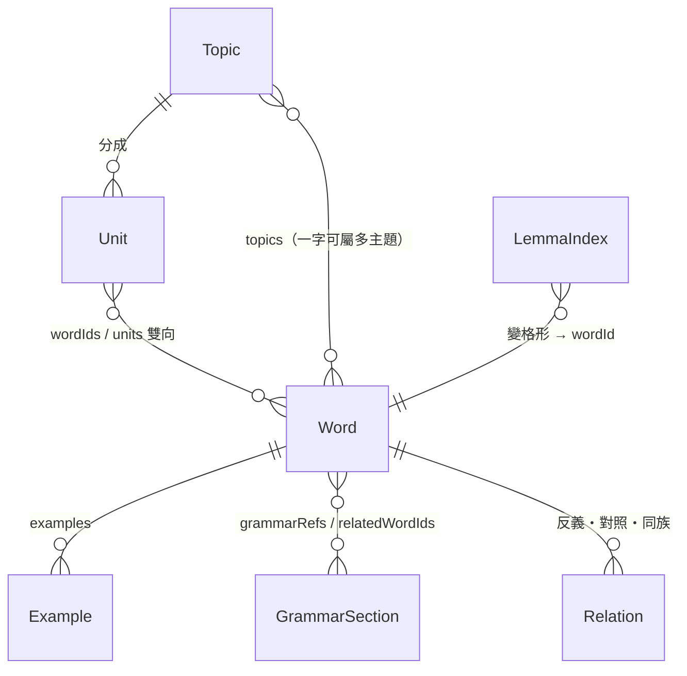
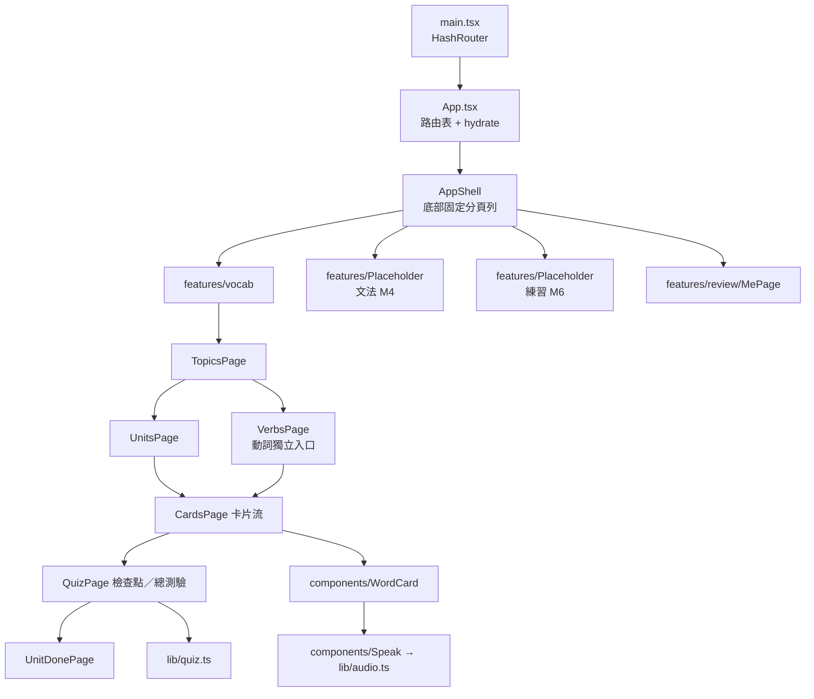
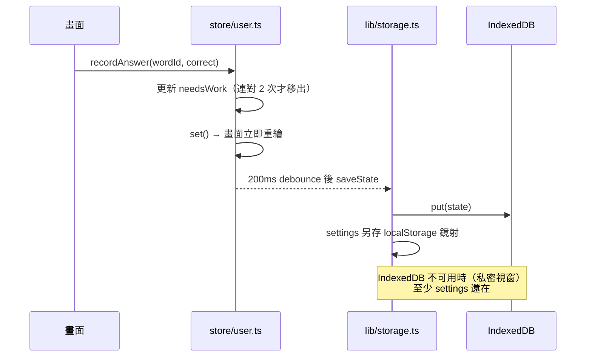
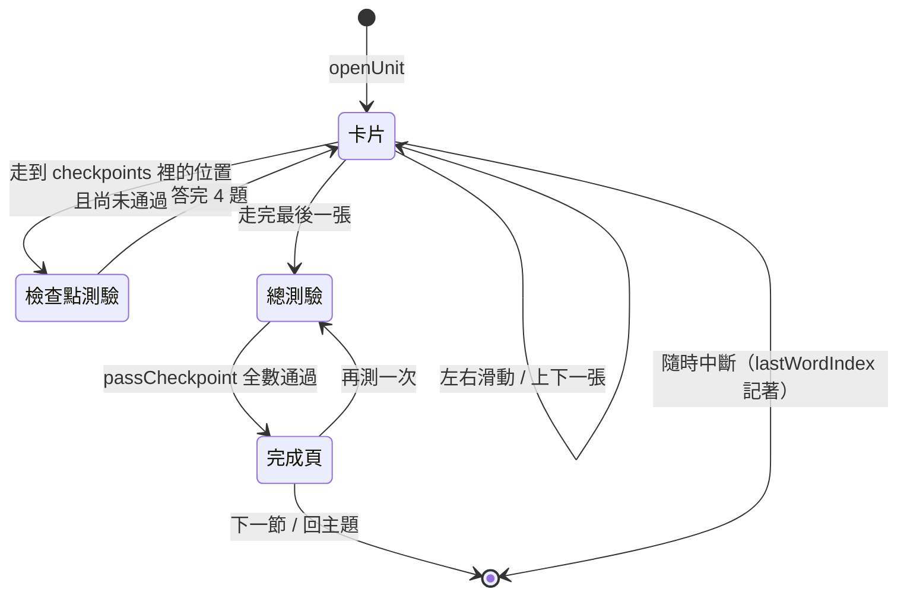
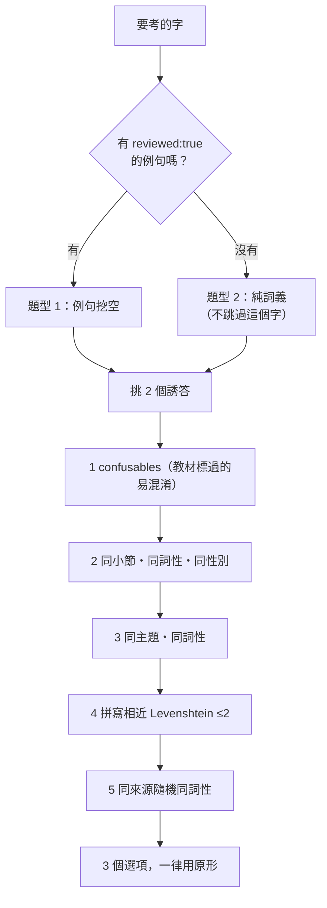

# 程式架構

ČEŠTINA APP 的實作架構。規格在 [`design-spec.md`](./design-spec.md)；這份文件講的是**程式怎麼組起來的**。

目前完成 M0（資料管線）與 M1（單字模組，無語音）。文中標 `M2`–`M7` 的地方是已經預留、但還沒實作的接點。

下面的圖在 GitHub 上會直接算成圖；要單獨的圖檔（PNG／SVG）看 [`diagrams/`](./diagrams/)，跑 `npm run diagrams` 會依這份文件重新產生。

---

## 1. 全景：兩個時期，一條單向的資料流

整個系統分成**建置期**與**執行期**，兩者只透過 `content/` 裡的 JSON 相接。執行期沒有後端、沒有 API、不連任何外部服務。



**為什麼要這樣切**：教材解析、headword 分類、小節切分這些工作只需要做一次，而且需要人工審閱（`REPORT.md`）。把它們放在建置期，執行期就只剩「讀 JSON、畫畫面、記進度」，App 可以完全離線，也不需要任何伺服器。

---

## 2. 目錄結構

```
sources/              教材原始 HTML（不進版控，放進來就會被優先讀取）
content/              ingest 產生，可整個刪掉重跑
  seed/               種子夾具：形狀與 HTML 解析結果完全相同
  authored/           人工／AI 撰寫，腳本只讀不寫
  REPORT.md           每次轉換的檢查報告
scripts/              建置期腳本（Node + tsx）
  lib/                管線的各個步驟，每步一個檔、可單獨測試
  ingest.ts           串起所有步驟
  validate.ts         產出物的守門員
src/
  types/              資料模型（建置期與執行期共用同一份型別）
  lib/                無 UI 的邏輯：內容索引、題目生成、播放器、儲存
  store/              Zustand 狀態
  components/         跨模組共用的 UI
  features/           依模組分資料夾：vocab / grammar / listening / reading / review
  styles/             CSS 變數與紙張質感
e2e/                  Playwright 煙霧測試
```

`src/types/content.ts` 同時被 `scripts/` 與 `src/` 匯入——**建置期寫出來的形狀與執行期讀進去的形狀是同一個型別**，schema 改了兩邊會一起編譯失敗，不會默默對不上。

---

## 3. 建置期：`scripts/ingest.ts` 的每一步



每一步的責任：

| 檔案 | 做的事 | 判不出來時 |
|---|---|---|
| `raw.ts` | 括號配對取出 `const T` / `const D`，`div.gram` 解析成節 | 找不到陣列就直接丟錯，不猜 |
| `classify.ts` | headword 六類（陰陽性對／體對／同義變體／形容詞／多詞拆開／`×` 對比） | 標 `needsReview`，列進 REPORT 等人工判定 |
| `notes.ts` | 從中文註記正則抽出反義、同族、只有複數、片語、易混淆 | 抽不出來的原樣留在 `note` |
| `verbs.ts` | 由不定式字尾＋現在式第一人稱推 `verbClass`；情態與移動動詞走白名單 | 推不出來歸第 4 類（不規則） |
| `units.ts` | 依來源排序、每 10 字一節、餘數處理 | — |
| `slug.ts` | 去變音符產生 ASCII id，撞名補序號 | — |

### 人工內容永遠贏



`ingest.ts` 可以無限次重跑，`content/authored/` 是它唯一不會寫的地方。這是「腳本可重跑」與「人工修正不會被洗掉」能同時成立的原因。

### 兩個踩過的坑（都留在程式碼註解裡）

1. **合併鍵不能去變音符**。`hořký`（苦）與 `horký`（熱）去掉符號後同形，會被併成一張卡——而它們正是教材標為易混淆的那一組。合併用原拼寫，只有搜尋與反查索引才放寬。
2. **§4.1 的兩條規則在餘數＝3 時互斥**。「餘數 <4 併入前一節」會讓該節變 13 字，違反「最多 12 字」。改成從前一節借 1 個字讓末節湊滿 4，兩節都落在 4–12。

---

## 4. 資料模型



幾個刻意的設計：

- **`Word` 是唯一的身分**。同一個字在不同課次、不同主題出現多次，合併成一個 `Word`；`topics` / `sources` 是陣列。這樣 ★ 與需加強狀態不會分裂成好幾份。
- **`Unit` 不擁有 `Word`**，只持有 `wordIds`。所以一個動詞能同時出現在「第 4 類」與「移動動詞對」兩節，`validate.ts` 會檢查兩邊參照一致。
- **`LemmaIndex` 是 `form → wordId[]`**，同時收原拼寫與去變音符形。點字查詞（§8）與全域搜尋（§9）共用這一份。

---

## 5. 執行期：畫面與狀態



路由用 **HashRouter**：靜態部署（GitHub Pages 之類）不需要伺服器做 rewrite。

### 狀態只有一個入口

所有進度都經過 `store/user.ts`，UI 不直接碰儲存層：



- 寫入 debounce 200ms，連續答題不會狂寫 IndexedDB。
- `normalize()` 會把舊存檔缺的欄位補成預設值，schema 長出新欄位不會讓舊使用者壞掉。
- 匯出／匯入走同一個 `normalize()`，所以匯入來路不明的 JSON 也不會讓 App 進入壞狀態。

### 一個小節的流程狀態機



進度只有三個狀態 `new` / `in-progress` / `done`，沒有分數、沒有正確率、沒有計時——這是規格的核心原則，不是還沒做。

---

## 6. 題目怎麼生出來（`lib/quiz.ts`）



兩個實作細節：

- **選項順序用固定種子的亂數**（`seededRandom(wordId + salt)`）。同一題重新 render 不會換順序，但「再測一次」帶不同的 `salt` 就會重排。
- **`reveal` 與題目同時產生、作答後才顯示**：句中真正的變格形與一行解釋（「這裡是第 4 格，`pokoj` 陽性無生命第 4 格與第 1 格同形」）。解釋是從 `case` / `person` / `gender` 推出來的，不是寫死的字串。

---

## 7. 測試佈局

| 層 | 工具 | 位置 | 測什麼 |
|---|---|---|---|
| 管線邏輯 | Vitest | `scripts/__tests__/pipeline.test.ts` | 六類分類、註記抽取、小節切分邊界、動詞推導 |
| 執行期邏輯 | Vitest | `src/lib/__tests__/` | 題目生成、誘答順序、狀態正規化、匯出匯入 |
| **產出的內容本身** | Vitest | `src/lib/__tests__/content.test.ts` | 合併是否正確、每節 ≤12 字、反查索引查得到、雙向參照一致 |
| 產出物守門 | 自製 | `scripts/validate.ts` | id 唯一、必要欄位、targetForm 真的在句中 |
| 關鍵流程 | Playwright | `e2e/smoke.mjs` | 主題→卡片→檢查點→動詞→我的，以及分頁列固定 |

中間那層「測產出的內容」是刻意的：`content/*.json` 是產生出來的，但它會被打包進 App，**壞掉的內容跟壞掉的程式一樣會壞掉畫面**，所以它也要被測。

---

## 8. 還沒實作的接點在哪

| 里程碑 | 接點已經在哪裡了 |
|---|---|
| M2 語音 | `lib/audio.ts` 的 `setManifest()`：填入 `audio-manifest.json` 後自動改播本地 mp3，播不到才退回 Web Speech API。`Speak` 元件不用改。 |
| M3 例句 | `content/authored/examples.json`，鍵可以是 wordId 或 headword；`reviewed: false` 的句子 App 不顯示。 |
| M4 文法 | `content/grammar.json` 已含 `categories` 與 `relatedWordIds`；`features/Placeholder.tsx` 換成真正的區塊清單與閱讀頁。 |
| M5 複習 | `store/user.ts` 的 `starred` / `needsWork` 已經是完整資料；缺的是混合複習流的畫面。 |
| M6 聽力閱讀 | 型別已定義，`content/listening.json` / `reading.json` 是空陣列；點字查詞要用的反查索引已經建好。 |
| M7 PWA | 靜態資源已全部本地化，加 `vite-plugin-pwa` 即可；深色模式與匯出匯入已完成。 |
